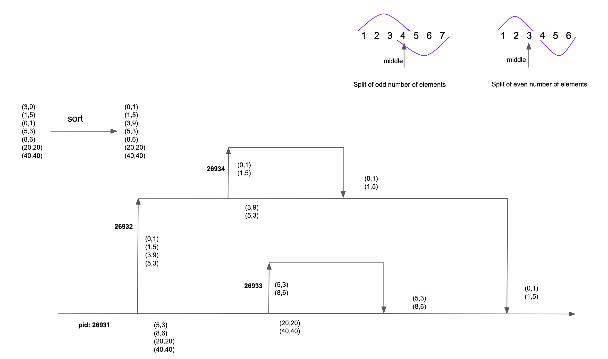

# Project description
Implementation of the algorithm to calculate closest pair of points in a 2-dimensional plane in time _O(n*log n)_ as described by _Algorithm Design by Jon Kleinberg, Eva Tardos_.

Here's an [explanation](https://www.cs.cmu.edu/~ckingsf/bioinfo-lectures/closepoints.pdf) of the algorithm based on the book. It is a [_divide and conquer_](https://en.wikipedia.org/wiki/Divide-and-conquer_algorithm) implementation that relies on some geometrical properties.

Implementation is done in different programming languages and using different parallelization techniques:


| Language    | Sequential | Multi-thread | Multi-process |
| ----------- | ----------- | ----------- | -----------   |
| C      | yes       | yes | yes |
| Python   | yes        | no | yes |
| Scala | yes | yes | no |


## Methodology
### Implementation of an oracle
We'll start by implementing the brute-force version of the algorithm: we calculate the distance of each point to all others and take the minimum.

This can be easily implemented and it will be used as [test oracle](https://en.wikipedia.org/wiki/Test_oracle) to prove the correctnes of the _divide and conquer_ implementation.

### Implementation of the sequential version of the algorithm
Next, we implement the algorithm using the _divide and conquer_ technique.

Unit testing is used to verify correctness of basic and edge cases and to guide development. Some of the test cases covered are:

- solution is in the left half
- solution is in the right half
- solution is a pair of points from different halves
- repeat points
- even number of points
- odd number of points


### Property-based testing
Using property-based testing, we compare the results of our algorithm to those generated by the oracle and for multiple inputs randomly generated.

This way we can cover thousands of test cases.

Depending on the language, we use different frameworks to do this testing:

- Scala, [Scalatest](https://www.scalatest.org/user_guide/property_based_testing)
- Python, [hypothesis](https://hypothesis.readthedocs.io/en/latest/)
- C, manual implementation


### Implementation of the parallel version
Depending on the language, we use multi-thread and/or multi-process approach to implement the parallel version of the algorithm.

And again, we can use property-based testing to compare sequential vs parallel versions.

### File-based testing
In order to compare the implementations across languages, we generate a file with random points that is fed to each language to ensure that all compute the same solution.


## Algorithm details
As we said, the algorithm to implement is a _divide and conquer_ recursion that runs in time _O(n*log n)_.

The input is split in two recursively, giving the time _O(log n)_.
The work to do in each iteration is linear, giving the time _O(n)_.

Run time of recursive algorithm = Run time of recursion process * Run time of work done on each step = _O(n*log n)_.

The __key element__ of the algorithm (something that probably is not sufficiently underscored in this  [explanation](https://www.cs.cmu.edu/~ckingsf/bioinfo-lectures/closepoints.pdf)) is to have the points sorted by coordinate _y_. 

The points get sorted before starting the recursive algorithm and they will remain sorted during the recursion as long as we split the input in a specific way. Basically, we need to keep two arrays of points, each of them sorted by a different coordinate, _x_ and _y_. Furthermore, the points sorted by coordinate _y_ will need to keep a reference to their position in the array sorted by _x_. And that's all, with that in mind, it should be easy to understand the implementation. 

Of course, we need to use a sorting algorithm that runs in _O(n*log n)_ like [mergesort](https://en.wikipedia.org/wiki/Merge_sort)

### Notation and terminology

The notation (variable names) used in the implementation is the one used in _Algorithm Design by Jon Kleinberg, Eva Tardos_.

Although those names may not comply with the rules to name objects in each of the languages used,
keeping the same notation across the board makes it easy to understand the code.

- P = array of points
- Px, Py = array of points sorted by coordinates _x_ and _y_ respectively
- Qx, Qy = left half part of P sorted by coordinates _x_ and _y_ respectively
- Rx, Ry = right half part of P sorted by coordinates _x_ and _y_ respectively


### Details of parallel algorithm

The parallel implementation is based on the [Fork-Join](https://en.wikipedia.org/wiki/Fork–join_model) model, that is very well suited for _divide and conquer_ algorithms.

Given that the algorithm to calculate the closest points is CPU-bound, we need real parallelism and not just concurrency. Therefore, Python's [GIL](https://docs.python.org/3/glossary.html#term-global-interpreter-lock) is not fit for purpose and only a multi-process implementation can take advantage of multiple cores.

On the other hand, multi-process implementation in the JVM is not as straightforward as in Python or C and therefore we opted for the multi-thread approach.

Here's a visual represenation of the parallel algorithm in actio (either multi-thread or multi-process):




## Favourite picks and lessons learnt

#### Learnings from PBT

Property-based testing (PBT) is an excellent tool to catch edge cases and to get insights about the inner workings of an application.

When some of the tests failed, I realised that solutions given by the quadratic algorithm are not stable as in, the solution depends on the original order of the points. For instance, given two possible solutions, the one selected is the one corresponding to the pair of points that come first.

On the other hand, solutions given by the _O(n*logn)_ algorithm are stable as they do not depend on the original order of the points.

As a consequence, we cannot just compare the pair of points given by each algorithm. The invariant that remains true though is the distance betwen each pair of points.

__Note:__ in case of multiple possible solutions, our implementation of the _O(n*logn)_ algorithm selects always:

- the pair of points with the lowest value of coordinate _x_ if solutions are in the left or right half
- the pair of points with the lowest value of coordinate _y_ if solutions are in the strip around the line dividing left and right halves

### Functional implementation of the brute force algorithm

The Scala version of the quadratic algorithm makes use of recursion and the _fold_ operation in order to avoid state mutations.


### Tediousness of multi-process implementation in Scala

Multi-process implementation in Scala is based on the Java API. It's remarkable how difficult is to implement the multi-process approach in Java/Scala compared to C and Python.

In C and Python, you can just invoke a function (passing its parameters alongside) in a new process in a similar way to invoking a new thread.

However, in Java/Scala that's not possible. On the contrary, you need to invoke a new `java` or `scala` commmand on a class and write the corresponding parameters as arguments to the command (that will get passed to the program as arguments of the corresponding `main` method)


### Deep integration between C and Python

Despite being opposites in terms of high/low level languages, Python and C can integrate very easily in some situations.

For instance, the binary file generated in C with the values of a sequence of random points represented as structs containing 2 integers, can be read easily in Python by using the `struct` module

```
struct.iter_unpack('ii', data)
```

Another example is Python's ease to map shared memory between processes in a similar way to C's `mmap` by making use of the object _[Value](https://docs.python.org/3/library/multiprocessing.html#sharing-state-between-processes)_


### Testing C version in different environments

After writing and testing my C code in my Mac, I decided to give it a go in a VM running Ubuntu.

To my surprise, I started to get random failures in the multi-process version of the program. For a while I assumed that it was something to do with the functions used to share memory between processes. 

But then I realised that it was a bug in my code as instead of using the function `waitpid`, I was using `wait`! And this bug would manifest as a race condition.

In my Mac it did not happen because it sports 8 cores and all the processes would run in parallel, finishing in the same order as they were started. On the other hand, the VM had 2 cores, resulting in the processes interleaving and originating the race conditions.

The moral: you can never test too much!